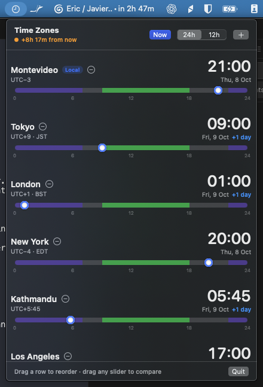
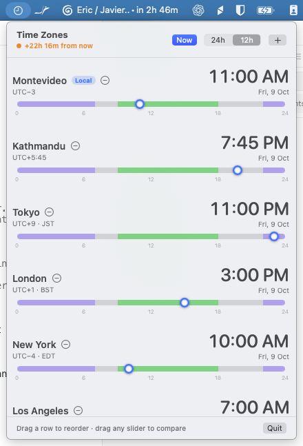
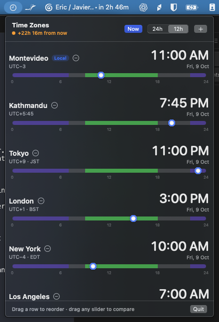
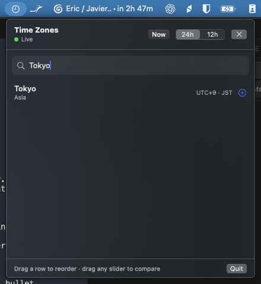
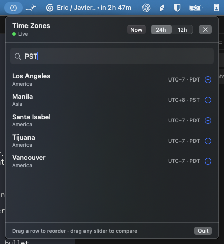

# TimeZoneBar

**"If it's 9 AM in Tokyo, what time is it for everyone else?"** Drag one slider and see the
answer for every zone at once, right from the macOS menu bar.


TimeZoneBar is a small, native, free menu bar app for people who work across time zones:
remote teams, people scheduling calls with family abroad, and anyone who has ever done
"they're 5h ahead... no wait, they changed their clocks last week" in their head.

<p align="center">
  
</p>

## Why another time zone app?

Most world clocks show you *now*. Planning a meeting needs *then*. In TimeZoneBar every zone has
its own 24-hour slider, and all of them share a single moment in time. Drag Tokyo to 09:00 and
London, New York and the rest jump to the matching time, with a `+1 day` / `−1 day` tag when
they land on another date. Green shading marks working hours (09:00–18:00) and purple marks the
night, so the slot where everyone is awake is easy to spot.

## Features

- **One shared moment.** Drag the slider in any row and every other row follows. Sliders snap
  to 15 minutes.
- **Correct in the hard cases.** All math goes through Apple's `Calendar`/`TimeZone` APIs, so
  DST and odd offsets work: India (UTC+5:30), Nepal (UTC+5:45), Chatham Islands (UTC+12:45), and
  the weeks when the US and Europe have changed their clocks but the other hasn't.
- **Search that understands people.** Type a city ("Tokyo", "New York", "Montevideo",
  "sao paulo") or an abbreviation ("PST", "CET", "JST", "IST"). All ~440 system time zones are
  included.
- **Useful at a glance.** Each row shows the city, UTC offset, abbreviation (JST, CEST...), a
  big clock, the date, and the day difference from your local zone.
- **Now button.** Jump back to the live time. While you look at another time, the header shows
  how far it is from now, for example "+3h 15m from now".
- Add, remove and drag to reorder zones. Your local zone is added on first launch and marked
  **Local**. 12h/24h toggle. Your list is remembered across restarts.
- **Menu bar only.** No Dock icon and no window to manage. Native SwiftUI, no third-party
  dependencies, no network access, no tracking.

<p align="center">
  
  
</p>
<p align="center">
  
  
</p>

## Download

Get the latest `TimeZoneBar.zip` from
[Releases](https://github.com/jastabile/macos-timezone-bar/releases), unzip it and move
`TimeZoneBar.app` to `/Applications`. The download is built for Apple silicon; on an Intel Mac,
build it from source.

The app is ad-hoc signed, not notarized by Apple, so macOS blocks the first launch. To open it,
right-click the app → **Open** → **Open**, or run:

```sh
xattr -dr com.apple.quarantine /Applications/TimeZoneBar.app
```

You can also build it yourself in about a minute (see below). It needs only Apple's free
Command Line Tools.

## Requirements

- macOS 13 or later.
- Command Line Tools for Xcode (`xcode-select --install`) or full Xcode. The project is a Swift
  package with shell scripts. It does not need Xcode or an `.xcodeproj`.

## Build

```sh
scripts/build-app.sh            # release build -> build/TimeZoneBar.app
scripts/build-app.sh debug      # debug build
```

The script runs `swift build`, puts the binary and `Resources/Info.plist` into
`build/TimeZoneBar.app`, and ad-hoc code-signs the bundle.

## Run

```sh
open build/TimeZoneBar.app
```

A clock icon appears in the menu bar. To quit, use the **Quit** button in the panel.

## Test

### Unit tests (time logic, search, persistence)

```sh
scripts/test.sh
```

The tests use **Swift Testing** (`import Testing`), not XCTest. The XCTest module only ships
with full Xcode, and this project has to build and test with Command Line Tools alone. The tests
cover:

- Converting a time set in one zone into other zones, with known answers in winter and summer.
- Zones with half-hour and 45-minute offsets: India +5:30, Nepal +5:45, Chatham +12:45/+13:45.
- US and EU DST changes, which fall on different dates. Includes the spring-forward gap and the
  fall-back overlap in both regions, and wall-clock slider positions on a 25-hour day.
- DST-aware abbreviations (CET/CEST, EST/EDT, and Dublin's "negative DST").
- Day-boundary labels and moving the slider past midnight.
- Persistence round trips (add, remove, move, 12h/24h, a new model reading the same defaults),
  plus first-launch defaults.
- Search ranking for city names and abbreviations.
- The live clock publishes only when the minute changes.

### End-to-end UI test (real app, Accessibility API)

```sh
scripts/build-app.sh
python3 scripts/ui-test.py      # screenshots go to build/screenshots/
```

This test launches the real `.app` and drives it through the Accessibility API with a small
helper (`scripts/uitest/axctl.swift`, which the script compiles). It checks the following:

- The app runs as a `UIElement` with no Dock icon, and its menu bar item exists.
- Adding zones through search works (it types real keystrokes).
- Setting Tokyo to 09:00 moves the other rows to the right times. A **real mouse drag** of
  London's slider to 12:00 does the same.
- Moving a slider to 24:00 crosses midnight correctly.
- **Now** resets to the live time, and the live clock keeps ticking.
- Dragging a row reorders the list, and removing a zone works.
- The 12h toggle works.
- **Quit** exits the app, and the list order and 12h setting survive a relaunch.
- The panel stays attached to the menu bar when its height changes.
- Screenshots are taken in light and dark appearance.

Expected times are computed separately with Python's `zoneinfo`, not with the app's code.

The UI test needs the following:

- The terminal app needs **Accessibility** and **Screen & System Audio Recording** permission
  (System Settings → Privacy & Security).
- The test resets this app's preferences (`defaults delete com.timezonebar.TimeZoneBar`).
- It moves the mouse.
- It briefly switches the system appearance to light and then dark, and restores your setting
  when it finishes. Don't use the computer while it runs (about 2 minutes).

## Install

```sh
scripts/build-app.sh
cp -R build/TimeZoneBar.app /Applications/
open /Applications/TimeZoneBar.app
```

To start the app at login, go to System Settings → General → Login Items & Extensions →
**Open at Login**, click **+** and choose `/Applications/TimeZoneBar.app`. Or run:

```sh
osascript -e 'tell application "System Events" to make login item at end with properties {path:"/Applications/TimeZoneBar.app", hidden:true}'
```

The app is ad-hoc signed, not notarized. A copy you build yourself runs without warnings. If you
copy it to another Mac, Gatekeeper may block it. In that case right-click the app → Open, or run
`xattr -dr com.apple.quarantine /Applications/TimeZoneBar.app`.

## How the time math works

The logic lives in `Sources/TimeZoneCore`, a library with no SwiftUI dependency. The app target
only handles presentation.

- The whole model is one optional reference `Date` (`nil` means live) plus the list of zone
  identifiers. Every row is rendered from that single instant.
- All conversions go through `Calendar` with the zone's `TimeZone` set, using
  `date(bySettingHour:minute:second:of:matchingPolicy:repeatedTimePolicy:direction:)`,
  `dateComponents` and `startOfDay`. The code never adds raw offsets, so DST and 30- or
  45-minute offsets come straight from the system tz database.
- A slider's position is the **wall-clock** time in its zone (minutes since local midnight). It
  is not elapsed time, so 18:00 sits at 18:00 even on a 23- or 25-hour DST day.
- During a drag, the slider is anchored to the calendar day the row showed when the drag began.
  The right end (24:00) is midnight at the start of the next day. To keep going past midnight,
  release at the end and drag again from the left. Other rows cross midnight on their own as the
  shared instant moves, and show `+1 day` / `−1 day`.

### DST behavior

| Situation | Example | Result |
|---|---|---|
| Wall time that does not exist (spring-forward gap) | New York 02:30 on 2026-03-08 | Becomes the first valid time after the gap: **03:00 EDT** (`matchingPolicy: .nextTime`). On that day, slider positions inside the gap snap to 03:00. |
| Wall time that happens twice (fall-back overlap) | New York 01:30 on 2026-11-01 | Becomes the **first** occurrence, 01:30 EDT (`repeatedTimePolicy: .first`). The second occurrence (01:30 EST) can't be picked with that zone's slider. You can reach it by dragging another zone's slider, and it then shows correctly, with the EST abbreviation. |
| Zones that change on different dates | NY vs London in mid-March | Correct: the offset between them is 4h instead of 5h until Europe changes. |

Abbreviations come from the system tz database, from the POSIX rule line at the end of
`/usr/share/zoneinfo/<zone>`. For most locales Foundation only returns "GMT+9" instead of "JST".
The file is used for names only. The app picks the standard or daylight name by matching the UTC
offset that Foundation reports.

## Project layout

```
Package.swift
Resources/Info.plist              LSUIElement = YES, bundle metadata
Sources/TimeZoneCore/             testable logic (no UI)
  ZoneMath.swift                  wall-clock <-> instant conversion, day differences, labels
  ZoneCatalog.swift               zone list, search, tz database abbreviations
  ComparisonModel.swift           shared-instant model, persistence (ZoneStore)
Sources/TimeZoneBar/              SwiftUI app
  TimeZoneBarApp.swift            MenuBarExtra(.window)
  PanelView.swift                 header (status, Now, 12h/24h, +), list, footer (Quit)
  ZoneRowView.swift               row + shaded 24h DaySlider
  AddZoneView.swift               search picker
  PanelWindowSizer.swift          keeps the panel sized to its content and attached to the menu bar
Tests/TimeZoneCoreTests/          Swift Testing unit tests
scripts/build-app.sh              build + assemble + sign the .app
scripts/test.sh                   run unit tests
scripts/env.sh                    toolchain/SDK workarounds shared by the scripts
scripts/ui-test.py                end-to-end UI test
scripts/uitest/axctl.swift        Accessibility helper used by the UI test
docs/screenshots/                 screenshots from the UI test run
```

## Contributing

Issues and pull requests are welcome. Please run `scripts/test.sh` (and, if you touch the UI,
`python3 scripts/ui-test.py`) before opening a PR.

## License

MIT. See [LICENSE](LICENSE).

## Known limitations and notes

- **Toolchain workarounds** (in `scripts/env.sh`; they do nothing when not needed):
  - Some Command Line Tools releases ship a macOS SDK whose SwiftUI declares `@State` as a macro
    but leave out the `SwiftUIMacros` plugin. In that case the scripts pick the newest installed
    SDK that doesn't need the plugin (here, `MacOSX26.5.sdk`). Set `SDKROOT` to override.
  - With Command Line Tools, SwiftPM sometimes leaves the swift-testing macro plugin path out of
    clean builds. `scripts/test.sh` passes it explicitly. A plain `swift test` can fail at random
    with "plugin for module 'TestingMacros' not found".
  - The linker prints "search path … not found" notes for directories that SwiftPM adds but
    Command Line Tools doesn't have. They are harmless and come from the toolchain, not this code.
- A slider spans one day per drag (00:00–24:00). Going further than a day needs a second drag,
  as described above.
- Working hours are fixed at 09:00–18:00 and aren't configurable.
- The menu bar panel closes when another app takes focus, as standard menu bar extras do.
- Apple's zone list still uses some old identifiers (e.g. `Asia/Calcutta`). The app shows that
  zone as "Kolkata", and search finds it under both names.
- The 12h/24h toggle overrides the system "24-hour time" setting, and AM/PM is always shown in
  English.
